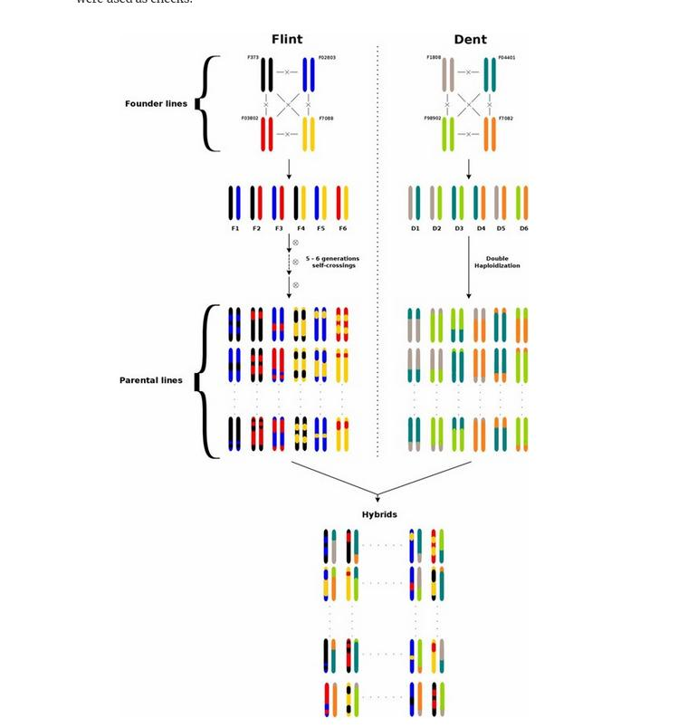

```{r}
rm(list = ls())
```


```{r setup, include=FALSE}
knitr::opts_chunk$set(echo = TRUE)
```


Temps d'exécution (voir l'annexe) :
```{r time_0}
t0 <- proc.time()
```


```{r}
packages <- c("nadiv", "rmarkdown", "MM4LMM", "ggplot2")

# Installer packages s'ils ne sont pas déjà installés
for (package in packages) {
  if (!requireNamespace(package, quietly = TRUE)) {
    install.packages(package)
  }
  suppressPackageStartupMessages(library(package, character.only = TRUE))
}
```


```{r}
# definir votre chemin à vous
setwd("~/Documents/PhD_Jemay/work/Universite-Quisqueya/UniQG-2026/week04/")
```


# TP Estimation des composantes de la variance

# Objectifs du travail

Ce TP est centré sur l'estimation des composantes de la variance génétique et des *breeding values* des individus.
  
Chez les plantes, il est facile de maîtriser les généalogies en organisant des plans de croisements plus ou moins complexes et l'analyse de variance est alors basée sur les effets parentaux et leurs interactions. Chez les animaux, la maîtrise de plans de croisements aussi structurés que chez les plantes est difficile, voire impossible, si ce n'est chez les huitres ou les poissons. Il s'est développé alors une autre méthode qui se base l'écriture d'une matrice de covariance des effets génétiques entre tous les individus étudiés. La covariance phénotypique entre individus est alors reliée à une matrice d'apparentement et à une hypothèse sur la distribution des effets génétiques. 
  
C'est cette approche qui sera explorée dans ce TD avec deux jeux de données: l'un simulé et l'autre réel sur des croisements de maïs (disponible dans le package R `MM4LMM`).

# 1 . Simulation des données selon un plan de croisement factoriel
Dans une première partie, nous allons simuler des données d’un plan de croisement factoriel. 

L’espèce est allogame. On utilise des plantes mâles, (en nombre *nmal*), que l’on croise avec des plantes femelles, (*nfem*) et on obtient un certain  nombre de descendants par croisement (*nind*).


## 1.1	Bases du modèle 

Répondez aux questions posées
 
  
- Décrivez les structures des familles obtenues.
  
- Sous quel régime de reproduction pouvez-vous écrire le modèle ?
  
- Quelle sera la matrice de variance-covariance entre individus d'après le modèle génétique ?
  

## 1.2.	Simulation des données

Une fonction **Factoriel** permet de simuler des données selon le modèle précédent.

Les données sont simplement générées par des tirages dans des lois normales pour les différents effets et assemblées ensuite pour créer une variable phénotypique.  

Il n'y a pas d'intérêt à expliquer le code dans le cadre de ce TD. Vous pourrez le reprendre à tête reposée si vous voulez le comprendre et l'améliorer.


```{r, include=FALSE}

Factoriel<-function(va, vd, ve, nmal, nfem, nind) {
# Ce bloc effectue les tirages des valeurs génétiques paternelles, maternelles et individuelles 
# La fonction rnorm simule des tirages dans une loi normale 
# la syntaxe rnorm( nombre_de_tirage , mean=moyenne, sd= ecart_type)

# tirage des effets paternels (on les centre sur la moyenne)
pere<-rnorm(nmal, mean=100, sd=(0.25*va)**0.5)

# tirage des effets maternels (centrés sur 0)
mere<-rnorm(nfem , mean=0, sd=(0.25*va)**0.5)

# tirages des effets d’interactions entre les parents  (centrés sur 0)
pere_mere<-rnorm(nmal*nfem, mean=0,sd=(0.25*vd)**0.5)

# tirages des effets individuels intra-familiaux à savoir génétique intra et environnementaux  (centrés sur 0)

ind<-rnorm(nmal*nfem*nind, mean=0, sd=(0.5*va + 0.75*vd +ve)**0.5)

# Ce bloc crée les différentes colonnes du futur fichier de données
# il y aura donc nmal x nfem x nind lignes dans le fichier
# le fichier comportera une colone avec le code du male (P comme père) 
# de la femelle (M comme mère), des individus (I), de Y la variable 
# phenotypique et d'un code (C)

P<-rep(NA, nmal*nfem*nind)
M<-rep(NA, nmal*nfem*nind)
I<-rep(NA, nmal*nfem*nind)
C<-rep(NA, nmal*nfem*nind)
Y<-rep(NA, nmal*nfem*nind)

# Triple boucle pour construire Y = Pere+ Mere + Individus/Croisement + Environnement
i<-0
for (m in 1:nmal) { 
  for(f in 1:nfem)  { 
      for(k in 1:nind) { 
      i<-i+1
      Y[i] = pere[m] + mere[f] + pere_mere[(m-1)*nfem+f] + ind[(m-1)*nfem*nind + (f-1)*nind +k] 
      P[i] = paste("m",m,sep="_")
      M[i] = paste("f",f,sep="_")
    	I[i]=  paste("I",k,f,m, sep=".")
      C[i]=(m-1)*nfem*nind + (f-1)*nind +k
}}}

# Assemblage dans un objet de type data.frame
D<-as.data.frame(cbind(C, P, M, I))
names(D)<-c("Code", "Pere", "Mere", "Individu")
D$Pheno<-as.numeric(Y)
return(D)
}

```
  
   
## 1.3.	Utilisation de la fonction
  
Il est par contre important que vous saisissiez les paramètres que 
vous allez utiliser pour simuler les données. 
  
Vous êtes maître du jeu. Vous pouvez spécifier les valeurs de la variation génétique additive (notation $\sigma_a^2$ ou Va), de dominance ($\sigma_d^2$ ou Vd) et environnementale ($\sigma_e^2$ ou Ve).
  
On fait ici l'hypothèse que les mâles et les femelles sont issus de la même population et ont donc les mêmes propriétés de variance.
  
Choisissez les valeurs de la variance génétique et environnementale.
  
```{r}
va=1
vd=1
ve=1

```
  
Choisissez ensuite les effectifs des parents mâles (nmal) et  femelles (nfem) impliqués dans le factoriel ainsi que le nombre d'individus (nind) dans chaque croisement.
  
```{r}
# valeurs initiales 5, 2, 2
nmal=10
nfem=10
nind=5
```
  
et exécutez la fonction pour créer un fichier de données. 
  
```{r}
D<-Factoriel(va=va,vd=vd,ve=ve,nmal=nmal,nfem=nfem,nind=nind)

head(D)
```
   
Combien d'individus ont-ils été créés ?
  
A combien de famille plein-frères et demi-frères cela correspond-il ?
  
Rappelez combien valent les cov(FS), les cov(HS) par les pères et par les mères dans une population panmictique non consanguine.


# 2.	Utilisation des matrices d’apparentement

## 2.1 Contexte

Il s'agit d'explorer le modèle utilisant les matrices d'apparentement et qui est qualifié historiquement comme le "modèle animal".

Le modèle complet prend en compte les effets additifs et d'interaction entre allèles au même locus (appelés par abus effets de dominance). Il s'écrit de la manière suivante :  

$$y  = \mu +X \beta + Z_au_a + Z_du_d +  \epsilon$$

où  

- $y$ est le vecteur des observations  

- $\mu + \beta X$ sont les effets fixes,  

- $Z_a$ et $Z_d$ les matrices d'incidence qui relient les données aux génotypes.  

- $u_a$  un vecteur d'effets aléatoires polygéniques additifs, qui sont en fait les *breeding values* des génotypes distribués selon la loi $u_a \sim N \left(0,2\phi_a\sigma_a^2\right)$ où la matrice de variance-covariance due aux effets additifs se décompose d'après le modèle génétique en:  
    + (1) $\sigma_a^2$ qui représente la variance polygénique des effets additifs et 
    + (2) $\phi_a$, la matrice $\left(n\ \times \ n\right)$ des coefficients de simple parenté entre les génotypes,  
  
- $u_d$  un vecteur d'effets aléatoires polygéniques de dominance, distribués selon la loi $u_d \sim N \left(0,\phi_d\sigma_d^2\right)$ où la matrice de variance-covariance due aux effets de dominance se décompose d'après le modèle génétique en 
    + (1) $\sigma_d^2$ qui représente la variance polygénique des effets de dominance (interaction) entre allèles au même locus et 
    + (2) $\phi_d$, la matrice $\left(n\ \times\ n\right)$ des coefficients de double parenté entre les génotypes. 

Il est très fréquent de voir ce modèle écrit dans une version simplifiée (sans les effets de dominance) : 

$$y  = \mu + \beta X + Zu + \epsilon$$

où $u$ est un vecteur d'effets aléatoires polygéniques additifs et $Z$ la matrice d'incidence qui relie les observations $y$ aux $u$.  
Le vecteur *u* est en fait $u_a$ du modèle précédent,  distribué selon $u \sim N \left(0,A\sigma_a^2\right)$ où $\sigma_a^2$ représente la variance polygénique des effets additifs et **A** directement la matrice $\left(n\ \times\ n\right)$ des relations (relationship matrix en anglais), et dans ce cas elle désigne directement les $2\phi_a$, faites bien attention à la définition que l'auteur d'un package R donne à la "relationship matrix", à la "kinship matrix" : le coefficient multiplicateur 2 peut être inclus ou pas par exemple. 

Dans ce TD, nous allons donc nous attacher à construire les matrices à partir des parentés connues (pédigrés). La matrice $A$ peut aussi s'estimer à partir de données de marqueurs, par exemple avec l'estimateur proposé par Van Raden ($A$ prend alors le nom de $K$ pour Kinship).   
La matrice $A\sigma_a^2$ est une matrice de variance covariance qui donne les covariances entre les valeurs génétiques additives ou breeding values (cov($u_{a}^{(x)}$,$u_{a}^{(y)}$)). De même, on peut définir la matrice $D$ à partir des $\phi_d$ et $D\sigma_d^2$ donne les covariances entre les valeurs génétiques de dominance-interaction (cov($u_{d}^{(x)}$,$u_{d}^{(y)}$)).


## 2.2 Construction des matrices d’apparentement

Il s’agit de calculer une ou plusieurs matrices d’apparentement, PhiA ($\phi_a$) ou PhiD ($\phi_d$).
  
Nous allons utiliser le package **nadiv**  pour cela. Il peut calculer une matrice à partir d’un pedigree.
  
Un fichier de pedigree se compose simplement d’un identifiant, d’un père (sire en anglais) et d’une mère (dam en anglais aussi) en référence à la génétique animale. Exemple :
  
$$\begin{matrix}
   Id & Sire & Dam \\
   A & Aldebert & Gertude\\
   B & Aldebert & Cunégonde\\
   C & Mr X & Cunégonde\\
\end{matrix}$$
  
  
Comme tous les individus doivent être référencés, les derniers ancêtres communs connus ont aussi des ascendants mais ils sont inconnus, donc ils reçoivent des valeurs NA pour leur père (sire) et leur mère (dam). NB: $MrX$ sera NA aussi pour ses parents). 
  
Ainsi il est facile de constituer le pedigree des individus simulés.
  
```{r}
# il faut fabriquer le fichier de pedigree
Pedigree<-as.data.frame(cbind(as.character(D$Individu), as.character(D$Pere), as.character(D$Mere)))

names(Pedigree)<-c("id","Sire","Dam")
head(Pedigree)
```
  
Pour utiliser le package nadiv qui va fabriquer les matrices de simple et de double apparentement (PhiA=Kinship and PhiD=fraternity/Dominance) il faut ajouter l'information sur les parents dont nous ne connaissons pas les parents *a priori*.   
Nous Utilisons la fonction *prepPed* de **nadiv** qui va les ajouter. 
  
```{r}
Ped<-prepPed(Pedigree)
```
  
La fonction *makeD* va ensuite calculer les matrices de simple (simple parenté, Kinship)  et de double parenté D (double parenté, fraternity). Appelons les MA et MD.
  
```{r}
MAT<-makeD(Ped, parallel = FALSE, ncores = getOption("mc.cores", 2L), invertD = FALSE, returnA = TRUE, det = TRUE)

MA<-MAT$A
MD<-MAT$D

MA[1:5, 1:5]
MD[1:5, 1:5]
```
  
Il nous reste à enlever les parents pour lesquels nous n'avons pas de données phénotypiques. Nous enlevons donc les lignes et les colonnes correspondant aux pères et aux mères. 
  
```{r}
D$Mere <- as.factor(D$Mere)
D$Pere <- as.factor(D$Pere)
liste<- rownames(MA) %in% levels(D$Mere) | rownames(MA) %in% levels(D$Pere)
MA<-MA[!liste,]
MD<-MD[!liste,]

liste<- colnames(MA) %in% levels(D$Mere) | colnames(MA) %in% levels(D$Pere)
MA<-MA[,!liste]
MD<-MD[,!liste]

```
  

La matrice sortie de *makeD* est une matrice "creuse" qu'il faut remettre dans un formalisme que vous connaissez mieux. 
  
```{r}
MA<-as.matrix(MA)
MD<-as.matrix(MD)

MA[1:10,1:5]
MD[1:10,1:5]

```
  
Regardez MA.  
  
A-t-elle les coefficients $\phi_A$ que vous attendiez ?
Que vaut MA en réalité ?

Regardez MD. Et ?
  

De quelle dimension est-elle ?  
```{r}
dim(MA)
```
  
  
## 2.3 Estimation des composantes de la variance
  
Nous pouvons maintenant utiliser le package **MM4LMM** pour l'estimation des composantes de la variance. 
Tout d'abord le vecteur des valeurs phénotypiques. 
```{r,fig.height=3}
y<-D$Pheno
names(y)<-D$Individu
length(y)

ggplot(D, aes(x=y))+
  geom_histogram(color="darkred", fill="pink",bins=7) +
  ggtitle("Distribution de la variable simulée")
```
  
Pour déclarer la matrice de covariance pour l'estimation de la variance résiduelle, nous créons une matrice identité. Cela signifie que tous les effets environnementaux et génétiques intra familles sont réellement indépendants les uns des autres. Vous auriez pu mettre les voisinages de rang 1 par exemple pour estimer une ressemblance locale (mais il faut créer une autre matrice). 
  
I est une matrice qui est carrée dont le nombre de dimensions est égale au nombre d'observations.  
  
```{r}
I<-diag(length(y))

I[1:5,1:5]
dim(I)

```
  
  
Le package **MM4LMM**  est très souple pour l'utilisation des matrices de covariance.  
Dans un premier temps nous utilisons seulement la matrice PhiA.  
  
```{r}

# Pour être sur que vous avez compris...
# PhiA<-MA/2
# A <- 2*PhiA

A <- MA

# modele A + D

##Build the VarList object
VL <- list(Additive = A , Dominance=MD, within =I)
ZL <- list(Za=I, Zd=I, Error = I)

##Perform inference
Result <- MMEst(Y=y , ZList=ZL, VarList = VL, Henderson=TRUE)
Result


# la moyenne
Result[[1]]$Beta

# les variances
Result[[1]]$Sigma2

```

Que valent vos estimations de variance additive ?  de dominance ?
Par rapport à ce que vous attendiez ?  

Que contient la variance within ici ?  

## 2.4 BLUPs et breeding values

Nous cherchons à prédire les $u_a$ qui sont les valeurs additives des génotypes étudiés.


Sous la condition de Normalité des effets aléatoires, la formule dite d'Henderson est utilisée pour prédire les $u_a$ sachant les données $y$ est donnée par 

$$
E(u_a|\mathbf{Y}=\mathbf{y})= Var(u_a)\mathbf{Z_a}' \Sigma^{-1} (\mathbf{y}-\mathbf{X}\beta)
$$
où $Var(u_a)$ est la matrice de variance covariance entre valeurs additives des individus, de dimension $(n \times n)$ si n est le nombre de génotypes, La matrice de variance-covariance phénotypique des $y$ est donnée par

$$Var(\mathbf{Y}) = \Sigma = \mathbf{Z_a}Var(u_a)\mathbf{Z_a}' + \mathbf{Z_d}Var(u_d)\mathbf{Z_d}' + Var(\varepsilon)$$
et 

- $\mathbf{Z'}$ désigne la transposée de la matrice d'incidence qui est dans notre cas est toujours la matrice identité ($I$)
- $\Sigma^{-1}$ est l'inverse de la matrice de la variance-covariance phénotypique,  
- $\mathbf{y}-\mathbf{X}\beta$ est le vecteur des valeurs phénotypiques centrée par l'écart aux effets fixes

On peut obtenir les blups selon la formule de Henderson en effectuant le calcul via la formule :

```{r}
# Dans notre cas :
Z= I  
dim(Z)

Vua = A*Result[[1]]$Sigma2[1]
dim(Vua)

Vud = MD*Result[[1]]$Sigma2[2]
dim(Vud)

Vres = I*Result[[1]]$Sigma2[3]
dim(Vres)

Sigma =  Vua + Vud  +Vres 
dim(Sigma)

residus = y-Result[[1]]$Beta
length(residus)

```
et on trouve
```{r}
ua = Vua %*% solve(Sigma) %*% residus
qqnorm(ua); qqline(ua,col="red")
```


de même pour $u_d$

```{r}
ud = Vud %*% solve(Sigma) %*% residus
qqnorm(ud); qqline(ud,col="red")
```
  
  
Leur distribution   
```{r,fig.heigt=3}
blup <- data.frame(ua=ua,ud=ud)

a = ggplot(blup, aes(x=ua))+
  geom_histogram(color="darkblue", fill="lightblue",bins=7)

d= ggplot(blup, aes(x=ud))+
  geom_histogram(color="darkgreen", fill="lightgreen",bins=7)

gridExtra::grid.arrange(a,d,ncol=2)
```

```{r}
# On peut aussi utiliser cette fonction de MM4LMM
# TODO: BlupVA <- MMBlup(Y=y , ZList = ZL, VarList = VL, ResMM=Result)
```


# 3. Exploration (TD - Devoir)

## 3.1 Précision des estimations
  Faites varier le nombre de mâles, de femelles et le nombre d'individus 
  
  Exécutez plusieurs fois (5-10 fois) avec les mêmes paramètres pour vous rendre compte de la puissance de votre dispositif pour estimer les paramètres.  
  

## 3.2 Effets de l'architecture génétique des caractères 
  Modifiez les relations entre les variances  
    - rapport additivité et dominance   
    - Parcourez 3 niveaux d'héritabilité (choisir une valeur par niveau), faible (0.1-0.2), moyenne (0.5-0.6) et fortes (0.8-0.9)  
    
    
## 3.3  Analysez et concluez. 

* Astuces: Collecter les données pour chaque **run** sur unt tableur excel. 
    
##  3.4 Rapport (2-3 page en PDF)

* Une page pour décrire les paramètres de simulations pour chaque **run** puis 1 ou 2 pages pour interprétations

* Indiquer **votre nom et prénom**.  

* **À rendre :** un document (rapport) uniquement le PDF. 

* **À envoyer à : jemay.salomon@inrae.fr**


# 4. Mise en oeuvre sur le jeu de données Maïs du package MM4LMM

Nous allons étudier ici les valeur génétiques additives de valeurs en descendance. Chez le Maïs, pour améliorer des hybrides F1 de Maïs, il faut améliorer la capacité des lignées à donner de bons hybrides.  
Pour obtenir des hybrides F1 de Maïs performants, on croise des lignées pures de fond génétique denté *Dent* avec des lignées de fond génétique *Flint*. Pour améliorer les lignées *Flint* pour leur aptitude générale à la combinaison (AGC) avec des lignées *Dent*, on évalue la valeur moyenne des hybrides F1 qu'elles donnent avec des lignées *Dent*. Il faut pouvoir calculer la part additive de ces AGC alors que les lignées *Flint* peuvent être apparentées entre elles de la même façon que les lignées *Dent* le sont entre elles.  Le raisonnement réciproque peut être fait avec les lignées *Dent*. 
L'objectif du sélectionneur est ensuite de recroiser entre elles les lignées *Flint* qui ont les meilleures valeurs additives (recroisement *intra Flint*) pour que leur descendance reste *Flint* et donnent de meilleurs hybrides.

On étudie le croisement suivant. Observez la figure et identifiez les individus sur lesquels on va mesurer des données (les phénotypes) et les individus pour lesquels on va calculer la valeur génétique. 

```{r,fig.width=12,fig.heigt=8}

# ref: https://doi.org/10.1534/genetics.117.300305
```

## 4.1 Données fournies

Ce jeu de données figure dans le package *MM4LMM*. 

```{r}
#### Example 1: variance component analysis, 1 model
data(VarianceComponentExample)

DataHybrid <- VarianceComponentExample$Data
```

Qu'y a-t-il dans le fichier ? 
Faites le lien avec la figure.

Combien y-t-il de lignées *Dent* ? de *Flint* ?
Utiliser la fonction **nlevels** qui  donne le nombre de niveau d'une variable déclarée comme facteur (**levels** donne la liste des facteurs)

```{r}
#nlevels()
#levels()
```

Les matrices de Kinship estimées par marqueurs sont les suivantes  :

```{r}
KinF <- VarianceComponentExample$KinshipF

KinD <- VarianceComponentExample$KinshipD
dim(KinD)
```

Quelles sont les dimensions de ces deux matrices?
Les valeurs sont-elles celles que vous attendiez ? 
Pourquoi sont-elles carrées ?

## 4.2 Construction du modèle et des matrices d'incidence pour le modèle des effets additifs parentaux

Le modèle d'analyse des phénotypes des plantes hybrides F1 ($y$) s'écrit en fonction des valeurs de leur lignées parentales. Le modèle ici est simplifié du point de vue génétique, dites en quoi ?  
Que contient $\epsilon$ ?

$$y  = \mu + \beta X + Z_{Flint} \, u_{(a,Flint)} + Z_{Dent} \, u_{(a,Dent)} +  \epsilon$$
A quoi devraient ressembler les matrices $Z_{Flint}$ et $Z_{Dent}$ ?

Voilà un bout de code pour les construire...
```{r}
##Build incidence matrix for each random effect
Zf <- t(sapply(as.character(DataHybrid$CodeFlint), function(x)
  as.numeric(rownames(KinF)==x)))

Zd <- t(sapply(as.character(DataHybrid$CodeDent), function(x)
  as.numeric(rownames(KinD)==x)))

```

Interprétez cette partie de la matrice Zf.
```{r}
Zf[1:10,1:5]
```

  
## 4.3 Estimation

Pour utiliser les fonctions de MM4LMM, il faut déclarer les matrices dans deux listes, l'une pour les matrices de variance-covariance, l'autre de matrices d'incidence. 

```{r}
##Build the VarList and ZList objects
VL = list(Flint=KinF , Dent=KinD , Error = diag(1,nrow(DataHybrid)))

ZL <- list(Flint=Zf , Dent=Zd , Error = diag(1,nrow(DataHybrid)))
```

Dans le modèle, on déclare ce design (ZL) et de relations (VL) et on peut aussi ajouter un effet fixe (ici l'essai avec l'option **Cofactor**).

```{r}
##Perform inference
#A first way to call MMEst
ResultVA <- MMEst(Y=DataHybrid$Trait , Cofactor = matrix(DataHybrid$Trial)
                  , ZList = ZL , VarList = VL,Henderson = TRUE)
length(ResultVA)
print(ResultVA)

#A second way to call MMEst (same result)
#Formula <- as.formula('~ Trial')
#ResultVA2 <- MMEst(Y=DataHybrid$Trait , Cofactor = DataHybrid,
#                   formula = Formula ,ZList = ZL , VarList = VL)
```

## 4.5 Effets additifs (breeding values)

Le package propose d'estimer les BLUP des effets des lignées *Dent* et *Flint*.
```{r}
BlupVA <- MM4LMM::MMBlup(Y=DataHybrid$Trait , Cofactor = matrix(DataHybrid$Trial)
                 , ZList = ZL , VarList = VL , ResMM=ResultVA)

head(BlupVA$Flint)
qqnorm(BlupVA$Flint); qqline(BlupVA$Flint,col="red")


head(BlupVA$Dent)
qqnorm(BlupVA$Dent); qqline(BlupVA$Dent,col="red")

```

```{r}
#A la main
# Zl matrice d incidence

# la variance additive de Flint, Dent et de l'erreur
VaruaF<-ResultVA$NullModel$Sigma2[1]
VaruaD<-ResultVA$NullModel$Sigma2[2]
varError<-ResultVA$NullModel$Sigma2[3]

sigma <- ZL$Flint %*% KinF %*% t(ZL$Flint) * VaruaF  + ZL$Dent %*% KinD %*% t(ZL$Dent) * VaruaD + diag(varError, nrow(DataHybrid))
```

```{r}
# les AGC de Flint et Dent
dim(KinF)
dim(ZL$Flint)

GEBV.Flint <- ZL$Flint %*% KinF * VaruaF
GEBV.Dent <-  ZL$Dent %*% KinD  * VaruaD

dim(GEBV.Flint)
dim(GEBV.Dent)
```

```{r}
# Les résidus
residus = DataHybrid$Trait - model.matrix(~Trial,data=DataHybrid)%*%ResultVA$NullModel$Beta
mean(residus)
# il y a un léger biais (estimation REML par défaut), si on enlève les moyennes plutôt que les valeurs prédites 
residus = DataHybrid$Trait - c(rep(mean(DataHybrid$Trait[DataHybrid$Trial=="Trial2"]),214),
                               rep(mean(DataHybrid$Trait[DataHybrid$Trial=="Trial1"]),218))
mean(residus)
```

```{r}
# Problème d'inversion de la matrice, on rajoute un peu sur la diagonale, les blup Henderson
BlupHenderson_Flint <- t(GEBV.Flint)%*%solve(sigma+diag(0.0000001,432))%*%residus 
# on retrouve les valeurs de MM4LMM
head(BlupHenderson_Flint)
head(BlupVA$Flint)      
```

Pour vérifier

```{r}
plot(BlupHenderson_Flint,BlupVA$Flint)
```

</div>
# Annexe

```{r info}
t1 <- proc.time(); t1 - t0
print(sessionInfo(), locale=FALSE)
```
